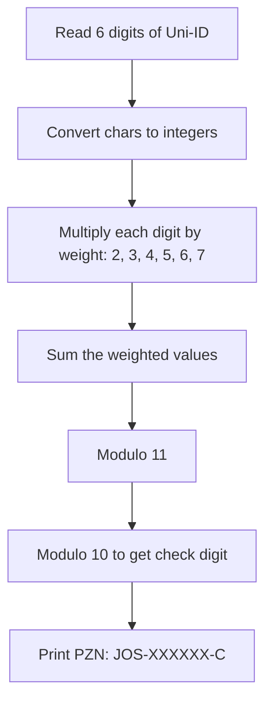
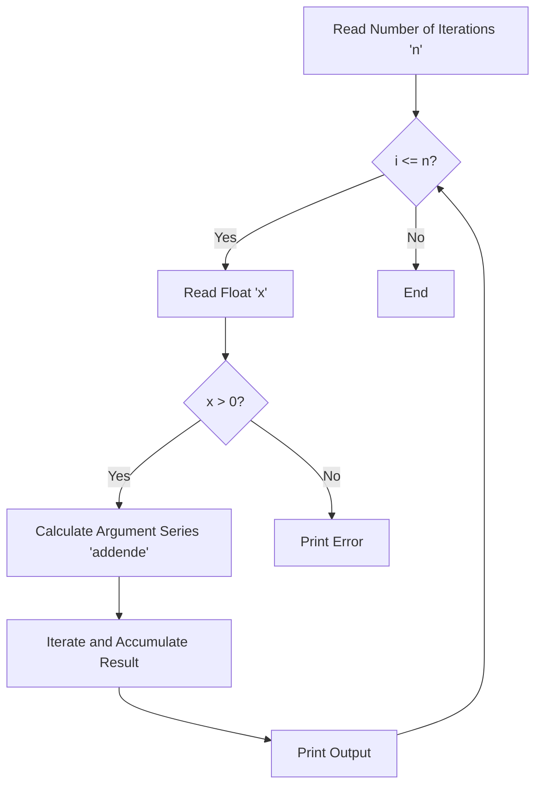
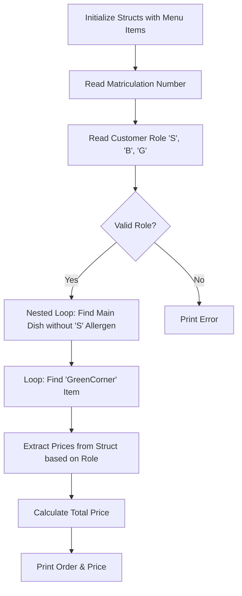
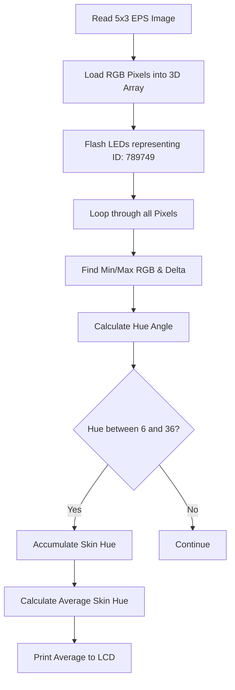

# Projects in C at the HSD School (2018-2019)

### HSD 01 - Uni ID to Pharma check number Converter | C
A basic programm to convert the Uni-ID into a phamaceutic-Check-Number (PZN in german).

#### Flowchart


#### Code Snippet
```c
  zsum1 = (nummer1-'0')*2;
  zsum2 = (nummer2-'0')*3;
  zsum3 = (nummer3-'0')*4;
  zsum4 = (nummer4-'0')*5;
  zsum5 = (nummer5-'0')*6;
  zsum6 = (nummer6-'0')*7;
  
  summe = (zsum1+zsum2+zsum3+zsum4+zsum5+zsum6);
  mod11 = summe%11;
  pruef = mod11%10;
```

---

### HSD 02 - Calculator for natural Logarithm | C
A basic programm to calculate the natural Logarithm ln(x) using an iterative series approximation.

#### Flowchart


#### Code Snippet
```c
  while((sumcount<789749%10000)&&((addende>=1.0/789749)||(addende<=-1.0/789749))){
    ergebnis=ergebnis+addende;
    sumcount=sumcount+1;
    minus=minus*(-1);
    potenz=potenz*reiargument;
    addende=minus*potenz/sumcount;
  }
```

---

### HSD 03 - Cafeteria Programm | C
This is a basic programm to search a Weekly Menu of a cafeteria based on the date and then calculate the price depending if the costumer is student, teacher or guest.

#### Flowchart


#### Code Snippet
```c
  /*Suchschleife: find valid main dish*/
  for (aussen=0; aussen<11; aussen++){
      for (innen=0;innen<10; innen++){
          if ((jahr_best[9].tageskarte[aussen].hauptgericht==1)&&(jahr_best[9].tageskarte[aussen].kennzeichnung[innen]!= 'S')){
              g_gericht = jahr_best[9].tageskarte[aussen];
          }
      }
  }

  /*preisberechnung*/
  if (pruefung == 'S') preiswahl = 0;
  if (pruefung == 'B') preiswahl = 1;
  if (pruefung == 'G') preiswahl = 2;
```

---

### HSD Bonus Task: Search machine for Pixels in a image and Hue calculation | C

This Project was the Final Bonus excercise in the 1 semester C course I visited at the HSD in Düsseldorf.
The Goal of the project was to create a programm that can display and find Pixel RGB values along the left, upper and right border of a image, mapping them to my Uni-ID: 789749.

#### Flowchart


#### Code Snippet
```c
  cmin = r < g ? r : g; //minimale farbwert berechnung rgb
  cmin = cmin < b ? cmin : b;
  
  cmax = r > g ? r : g; //maximale farbwert berechnung rgb
  cmax = cmax > b ? cmax : b;
  
  delta = cmax - cmin; //unterschied cmin <-> cmax
  
  if (delta == 0) {
    hue = -1;
  }
  else {
    if ( r == cmax ) {
      tmp = ( (float)g - b ) / delta;
    } else if ( g == cmax ) {
      tmp = 2 + ( (float)b - r ) / delta;
    } else {
      tmp = 4 + ( (float)r - g ) / delta;
    }
    tmp *= 60; // Winkel in Grad
```
