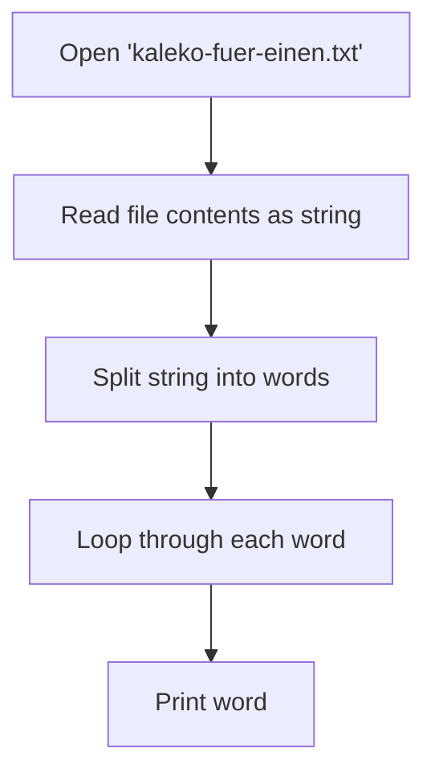
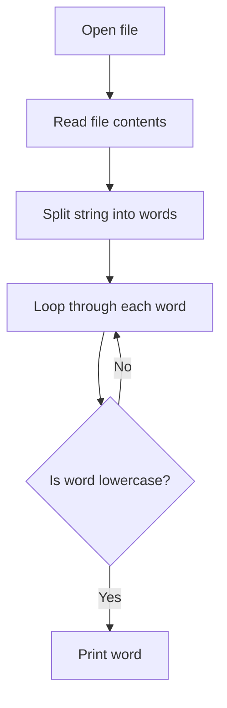
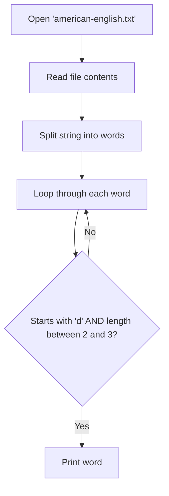

# PA01

### Task 1: Print words line by line
Write a programm that outputs all words in the attached `Kaleko-fuer-einen.txt` file line by line.

#### Flowchart


#### Code Snippet
```python
f = open("kaleko-fuer-einen.txt", encoding="utf-8")
words = f.read()
f.close()

for word in words.split():
    print(word)
```

---

### Task 2: Print lowercase words
Write a programm that outputs all non-capital words.

#### Flowchart


#### Code Snippet
```python
f = open("kaleko-fuer-einen.txt", encoding="utf-8")
words = f.read()
f.close()

for word in words.split():
    if word.islower():
        print(word)
```

---

### Task 3: 3-letter words starting with 'D'
Write a programm that outputs every 2 to 3 letter long word starting with "D".

#### Flowchart


#### Code Snippet
```python
f = open("american-english.txt", encoding="utf-8")
words = f.read()
f.close()

for word in words.split():
    if word.startswith("d") and 2 <= len(word) <= 3:
        print(word)
```
