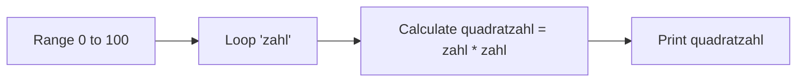
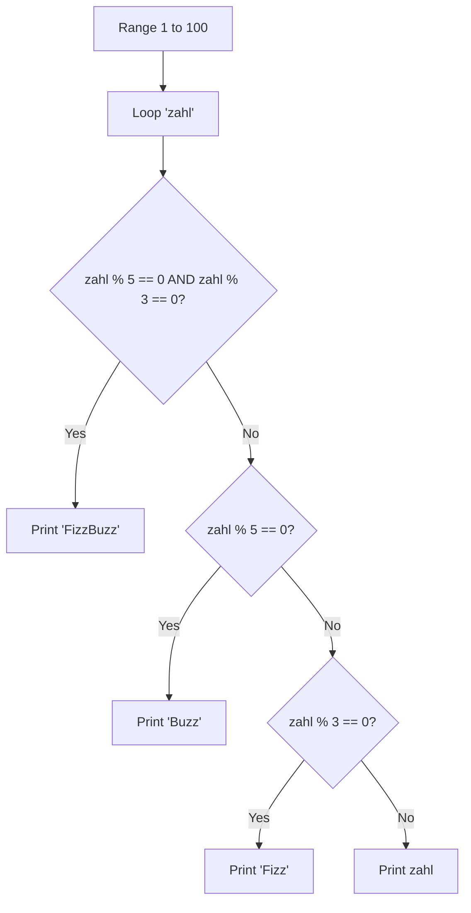
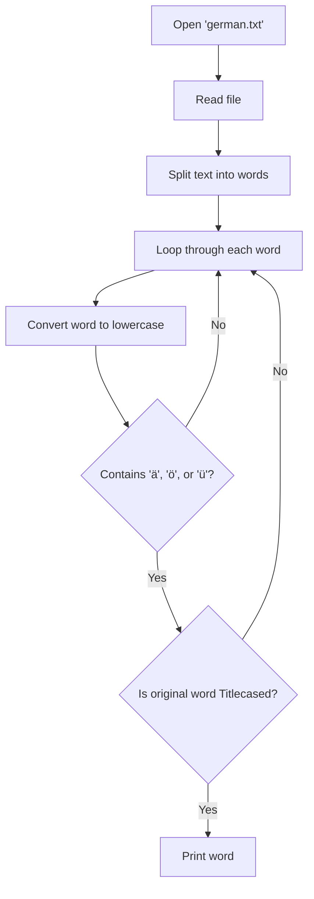

# PA02

### Task 1: Squared numbers
Write a programm that outputs all squared numbers of the numbers from 0 to 100.

#### Flowchart


#### Code Snippet
```python
x = range(0, 101, 1)
for zahl in x:
    quadratzahl = zahl * zahl
    print(quadratzahl) 
```

---

### Task 2: FizzBuzz
Write a programm that outputs all numbers from 1 to 100. if the number is divisible by 3 replace it with "Fizz" if it is replaceable by 5 replace it with "Buzz" and if both condition apply replace it with "FizzBuzz".

#### Flowchart


#### Code Snippet
```python
x = range(1, 101, 1)
for zahl in x:
    if zahl%5==0 and zahl%3==0: 
        print("FizzBuzz")
    elif zahl%5==0:
        print("Buzz")
    elif zahl%3==0:
        print("Fizz")
    else:
        print(zahl)
```

---

### Task 3: Capitalized words with Umlauts
Write a programm that reads `german.txt` and outputs every capitalized word that also contains an umlaut (ä, ö, ü).

#### Flowchart


#### Code Snippet
```python
f = open("german.txt", encoding="utf-8")
text = f.read()
f.close()
for word in text.split():
    lowerword = word.lower()
    if "ä" in lowerword or "ö" in lowerword or "ü" in lowerword:
        if word.istitle():
            print(word)
```
